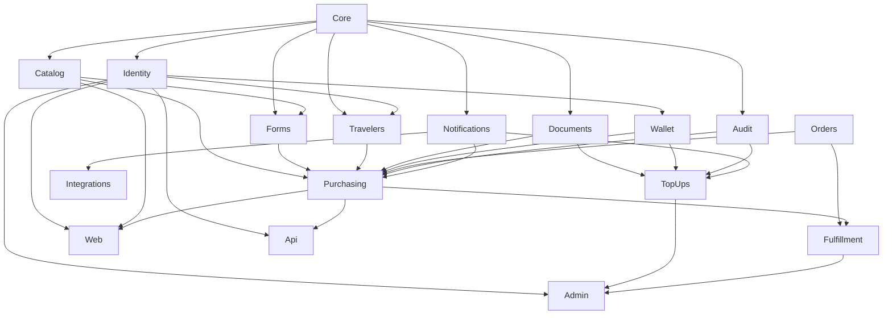

# معمارية Laravel بالحزم لمشروع رحلة

هذه الوثيقة هي العقد المعماري المقترح لتنفيذ متطلبات [مفهوم مشروع رحلة ورحلة المستخدم](REHLA-PROJECT-CONCEPT-AND-USER-JOURNEY.md) باستخدام Laravel. تغطي الإصدار الأول، واجهات Web وREST API ولوحة الإدارة، حدود الحزم، ملكية البيانات، المعاملات، الصلاحيات، التخزين، المهام، الاختبارات، والتوسع المستقبلي.

حالة الوثيقة: **تصميم مستهدف؛ لم تُنشأ الحزم أو قاعدة التطبيق بعد**.

خطة البناء التنفيذية الكاملة: [Rehla Platform Implementation Plan](superpowers/plans/2026-09-11-rehla-platform-build.md)، ومنها سبع خطط مرتبة و34مهمة ذات دورات RED/GREEN وبوابات تحقق.

## 1. القرار المعماري

يبنى رحلة كتطبيق **Modular Monolith** واحد فوق Laravel، بقاعدة PostgreSQL واحدة، وتوضع مجالات العمل والواجهات في حزم Composer محلية مستقلة تحت:

```text
packages/Rehla/<Package>
```

الحزمة هي حد الملكية والفهم والاختبار. لا تعني الحزم Microservices، ولا تملك كل حزمة قاعدة بيانات أو عملية نشر منفصلة. تشترك الحزم في تطبيق Laravel ومعاملة قاعدة البيانات حين تتطلب قواعد رحلة ذلك.

اخترنا `packages` لأن المشروع يحتوي حدودًا مستقرة بين الحساب والمسافر والخدمة والمحفظة والشحن والطلب والتنفيذ. يوفر هذا التنظيم:

- `composer.json` وnamespace واختبارات وREADME لكل مجال.
- اعتمادًا معلنًا بين الحزم يمكن فحصه آليًا.
- مساحة تغيير محدودة لوكيل البرمجة.
- إمكانية استخراج حزمة لاحقًا إذا ظهر سبب تشغيلي حقيقي.
- منع واجهات Web وAPI وAdmin من امتلاك منطق الأعمال.

Laravel لا يفرض هذا التنظيم؛ يدعم Composer تحميله. لذلك يجب فرض الحدود باختبارات معمارية، وليس بالمجلدات وحدها. [Laravel directory structure](https://laravel.com/framework/docs/13.x/structure).

## 2. التقنية الأساسية

| الطبقة | القرار |
|---|---|
| Framework | Laravel 13.x مع تثبيت patch محدد في `composer.lock` |
| Runtime | PHP 8.5 ضمن نطاق دعم الإصدار المختار |
| Database | PostgreSQL 18، مع نسخة اختبار PostgreSQL حقيقية |
| Customer Web | Blade + Livewire، جلسات Laravel، EN افتراضي وAR/RTL |
| REST API | JSON API بإصدار `/api/v1` وتوثيق OpenAPI 3.1 |
| Admin | Filament 5، ويستدعي أوامر التطبيق نفسها |
| Authentication | Session للويب والإدارة؛ Sanctum لعملاء API عند تفعيلهم |
| Authorization | Gates/Policies وقدرات دقيقة، والمنع هو الافتراضي |
| Queue | Laravel Queue مع Outbox محفوظ في PostgreSQL |
| Cache | تحسين للقراءات فقط؛ ليس مصدر حقيقة للمال أو الصلاحيات |
| Storage | قرص خاص للمستندات وقرص عام منفصل للصور التسويقية |
| Testing | Pest أو PHPUnit، واختبارات PostgreSQL وتكامل وHTTP ومتصفح |
| Agent support | Laravel Boost ومهارات Laravel/Filament مع قواعد رحلة المحلية |

لا يفرض التصميم GraphQL أو Redis أو محرك Workflow خارجيًا. تضاف هذه المكونات عند وجود متطلب أو قياس يبررها.

## 3. هيكل المستودع

```text
rehla3/
├── app/
│   └── Providers/
│       └── AppServiceProvider.php
├── bootstrap/
│   ├── app.php
│   └── providers.php
├── config/
├── database/
│   └── seeders/                  # تنسيق seed العام فقط
├── lang/
│   ├── en/
│   └── ar/
├── packages/
│   └── Rehla/
│       ├── Core/
│       ├── Identity/
│       ├── Catalog/
│       ├── Forms/
│       ├── Travelers/
│       ├── Documents/
│       ├── Wallet/
│       ├── TopUps/
│       ├── Orders/
│       ├── Fulfillment/
│       ├── Purchasing/
│       ├── Notifications/
│       ├── Content/
│       ├── Audit/
│       ├── Reporting/
│       ├── Integrations/
│       ├── Web/
│       ├── Api/
│       └── Admin/
├── resources/
│   ├── css/
│   └── js/
├── routes/
│   └── console.php               # أوامر المضيف فقط
├── tests/
│   ├── Architecture/
│   ├── EndToEnd/
│   └── Support/
├── composer.json
├── composer.lock
└── phpunit.xml
```

يعرّف `composer.json` في الجذر repository من النوع `path` على `packages/Rehla/*`. لكل حزمة `composer.json` خاص بها وPSR-4 مثل `Rehla\\Wallet\\`. تعتمد الحزمة على أسماء Composer للحزم الأخرى، وتسجل Service Provider عبر Laravel package discovery. يقلل ذلك تعديل ملفات تسجيل مركزية عند إضافة الحزم.

مثال العقد في الجذر:

```json
{
  "repositories": [
    {
      "type": "path",
      "url": "packages/Rehla/*",
      "options": { "symlink": true }
    }
  ],
  "require": {
    "rehla/web": "@dev",
    "rehla/api": "@dev",
    "rehla/admin": "@dev"
  }
}
```

لا تنسخ الحزم إلى `vendor` أثناء التطوير. يثبت CI الاعتمادات من `composer.lock` دون الاعتماد على ملفات خارج المستودع. كل migration موجود داخل الحزمة المالكة للجدول، وتحمله Service Provider الخاص بها. أسماء الجداول عالمية وواضحة، ولا تنشئ حزمتان migration للجدول نفسه.

## 4. الحزم ومسؤولياتها

| الحزمة | المسؤولية | أهم البيانات التي تملكها |
|---|---|---|
| `Core` | قيم وأدوات مستقلة يحتاجها أكثر من مجال | لا جداول أعمال؛ `Money` وIDs وClock ونتائج الأخطاء |
| `Identity` | الحسابات والموظفون والأدوار والقدرات | users، staff profiles، roles، abilities، assignments |
| `Catalog` | الخدمات والأسعار والمتطلبات والصور والترتيب والتفعيل | services، service requirements، service media، price history |
| `Forms` | مسودات نماذج الخدمات وإصداراتها المنشورة والتحقق منها | form drafts، form versions، schemas/checksums |
| `Travelers` | المسافر وملكيته وتطبيع الجواز وتفرده | travelers |
| `Documents` | metadata للملفات والملكية والتصنيف والتخزين الخاص والعام | documents، upload sessions، retention state |
| `Wallet` | المحافظ والرصيد والقيود غير القابلة للتعديل والتسوية | wallets، wallet ledger entries، reconciliation runs |
| `TopUps` | البنوك وطلبات التحويل ومراجعتها | bank accounts، top-up requests، reviews، receipt links |
| `Orders` | السجل التجاري الثابت ولقطات الشراء | orders، service/traveler/price snapshots، debit reference |
| `Fulfillment` | تنفيذ الخدمة وحالاتها وإجاباتها ومطلوبات العميل | executions، responses، status history، notes، action requests، document links |
| `Purchasing` | تنسيق إرسال الطلب والـidempotency والمعاملة المشتركة | purchase attempts/idempotency records |
| `Notifications` | الإشعارات داخل التطبيق وOutbox ومحاولات التسليم | outbox messages، deliveries، in-app notifications |
| `Content` | صفحات ومحتوى الموقع العام | pages، localized content |
| `Audit` | سجل القرارات الحساسة غير القابل للمحو | audit entries |
| `Reporting` | قراءات ومؤشرات القسم 62 | read models أو materialized views؛ لا يكتب سجلات المصدر |
| `Integrations` | adapters للقنوات والمزودين الخارجيين | provider credentials references، delivery/provider logs عند الحاجة |
| `Web` | المتجر وحساب العميل بواجهات Blade/Livewire | لا يملك بيانات أعمال |
| `Api` | REST API v1، الموارد، OpenAPI، وتحويل الأخطاء | لا يملك بيانات أعمال |
| `Admin` | Filament ولوحة التشغيل والصلاحيات | لا يملك بيانات أعمال |

`Purchasing` حزمة Process وليست كتالوج تجارة. وجودها يمنع جعل `Orders` أو `Wallet` يعتمد أحدهما على الآخر في الاتجاهين، ويمنح عملية الشراء الذرية مالكًا واحدًا.

يعرف `Purchasing` عقد `ExecutionCreator` الذي يحتاجه SubmitOrder، وتنفذه `Fulfillment`. لذلك تعتمد Fulfillment وقت البناء على Purchasing، بينما يستدعي Purchasing العقد الذي يملكه دون استيراد Fulfillment. يسجل Service Provider الخاص بـFulfillment الربط وقت التشغيل. هذا Dependency Inversion يمنع دورة Composer ويحافظ على المعاملة المشتركة.

## 5. بنية كل حزمة أعمال

تبدأ الحزم ببنية Laravel مسطحة وقابلة للتوقع، ولا تنشئ طبقات فارغة:

```text
packages/Rehla/TopUps/
├── composer.json
├── README.md
├── config/
├── database/
│   ├── factories/
│   ├── migrations/
│   └── seeders/
├── resources/
│   └── lang/
│       ├── en/
│       └── ar/
├── src/
│   ├── Actions/                   # حالات استخدام الكتابة
│   │   ├── SubmitTopUp.php
│   │   ├── ApproveTopUp.php
│   │   └── RejectTopUp.php
│   ├── Queries/                   # قراءات بلا أثر جانبي
│   ├── Data/                      # DTOs للمدخلات والنتائج
│   ├── Models/                    # Eloquent داخل مالك الجدول
│   ├── Enums/
│   ├── Policies/
│   ├── Events/
│   ├── Exceptions/
│   ├── Contracts/                 # السطح المسموح للحزم الأخرى
│   ├── Infrastructure/            # storage/provider adapters عند الحاجة
│   └── TopUpsServiceProvider.php
└── tests/
    ├── Unit/
    ├── Feature/
    └── Integration/
```

القواعد المعقدة الخالصة، مثل انتقالات الحالة أو `Money`، يمكن وضعها في `Domain/` داخل الحزمة. لا يضاف `Repository Interface` لكل Model تلقائيًا؛ يضاف عندما تعبر العملية حد حزمة أو يوجد أكثر من تنفيذ أو يحتاج الاختبار إلى عزل اعتماد خارجي.

كل `README.md` للحزمة يحدد:

- مسؤوليتها وما لا تملكه.
- جداولها وواجهاتها العامة.
- الحزم التي تعتمد عليها والسبب.
- الأوامر والاستعلامات والأحداث العامة.
- invariants وأوامر الاختبار.
- قرارات الأمان والخصوصية الخاصة بها.

الأسطح العامة الحرجة تكون صغيرة ومسمّاة حسب النتيجة، مثل:

```text
Catalog:      GetCurrentServiceQuote
Forms:        GetPublishedForm + ValidateFormSubmission
Travelers:    GetOwnedTravelerSnapshot
Documents:    ValidateOwnedDocuments
Wallet:       CreditWallet + DebitWallet
Orders:       CreatePaidOrder
Fulfillment:  CreateExecution + TransitionExecution
Audit:        AppendAuditEntry
Notifications: AppendOutboxMessage
```

تعيد هذه العقود Data objects ومعرفات وقيمًا ثابتة، ولا تعيد Model قابلًا للتعديل إلى حزمة أخرى. `Purchasing` يجمعها في `SubmitOrder`، و`TopUps` يستعمل عقد `CreditWallet` فقط.

## 6. قواعد الاعتماد



الأسهم تعني «يوفر اعتمادًا إلى المستهلك»؛ مثال: `Catalog --> Purchasing` تعني أن `Purchasing` يعتمد على السطح العام لـ`Catalog`. يوضح الرسم مسارات الكتابة الأهم، والجدول التالي هو المرجع الكامل للاعتمادات المسموحة:

| المستهلك | الحزم المسموح أن يعتمد عليها |
|---|---|
| Core | لا شيء من Rehla |
| Identity | Core |
| Audit | Core |
| Catalog | Core, Documents, Audit |
| Forms | Core, Catalog, Audit |
| Travelers | Core, Identity, Audit |
| Documents | Core, Identity, Audit |
| Wallet | Core, Identity, Audit |
| Notifications | Core, Identity |
| TopUps | Core, Identity, Documents, Wallet, Audit, Notifications |
| Orders | Core |
| Purchasing | Core, Identity, Catalog, Forms, Travelers, Documents, Wallet, Orders, Audit, Notifications |
| Fulfillment | Core, Identity, Orders, Forms, Documents, Purchasing, Audit, Notifications |
| Content | Core, Identity, Audit |
| Integrations | Core, Notifications, Fulfillment |
| Reporting | عقود القراءة في Identity, Travelers, Catalog, TopUps, Orders, Fulfillment, Notifications |
| Web | Core, Identity, Catalog, Forms, Travelers, Documents, Wallet, TopUps, Orders, Fulfillment, Purchasing, Notifications, Content, Integrations |
| Api | Core, Identity, Catalog, Forms, Travelers, Documents, Wallet, TopUps, Orders, Fulfillment, Purchasing, Notifications |
| Admin | Core, Identity, Catalog, Forms, Travelers, Documents, Wallet, TopUps, Orders, Fulfillment, Notifications, Content, Audit, Reporting |

أي اعتماد غير موجود في الجدول يحتاج تحديثًا معللًا لهذه الوثيقة واختبار Architecture قبل إدخاله. النسخة المقروءة آليًا هي [rehla-package-map.json](architecture/rehla-package-map.json)، ومنها يتحقق CI من manifests وimports والدورات والترتيب الطوبولوجي.

قواعد ملزمة:

1. `Core` لا يستورد أي حزمة من `Rehla`.
2. حزم الأعمال لا تستورد `Web` أو `Api` أو `Admin`.
3. حزم الواجهات لا تكتب جداول الأعمال مباشرة، ولا تبدأ المعاملات المالية.
4. لا تستورد حزمة `Models` الداخلية لحزمة أخرى. تستخدم `Contracts` وData objects ومعرفات typed.
5. القراءة الإدارية عبر Query DTO أو `Contracts/ReadModels` عامة للقراءة فقط. لا يوجد استثناء مفتوح لاستيراد Model داخلي.
6. كل جدول له مالك واحد. المفاتيح الأجنبية عبر الحزم مسموحة، والكتابة عبر الحدود ممنوعة.
7. `Reporting` يقرأ من views أو Queries معلنة ولا يصبح مسار تعديل للبيانات.
8. الحزم لا تستعمل Service Locator أو Facades لإخفاء اعتماد بين المجالات داخل منطق الأعمال.
9. تفشل اختبارات Architecture عند وجود اعتماد غير معلن أو دورة بين الحزم.

## 7. واجهات التطبيق الثلاث

### 7.1 Web

```text
packages/Rehla/Web/
├── src/
│   ├── Http/Controllers/
│   ├── Http/Requests/
│   ├── Livewire/PublicSite/
│   ├── Livewire/Account/
│   ├── ViewModels/
│   └── WebServiceProvider.php
├── routes/web.php
├── resources/views/
├── resources/lang/{en,ar}/
└── tests/Feature/
```

تشمل الواجهة العامة Home وServices وService Details وWhatsApp. وتشمل واجهة الحساب Profile وTravelers وWallet وTop-ups وOrders وNotifications. فتح نموذج الطلب لا ينشئ Order ولا يحجز رصيدًا. يحفظ رفع الملف Upload مؤقتًا خاصًا يمكن تنظيفه، وليس مسودة طلب.

### 7.2 REST API

```text
packages/Rehla/Api/
├── openapi/rehla-v1.yaml
├── routes/api_v1.php
├── src/
│   ├── Http/Controllers/V1/
│   ├── Http/Requests/V1/
│   ├── Http/Resources/V1/
│   ├── Http/Middleware/
│   ├── Errors/ProblemDetailsFactory.php
│   └── ApiServiceProvider.php
└── tests/
    ├── Contract/
    └── Feature/
```

المسارات الأساسية للإصدار الأول:

```text
POST   /api/v1/auth/register
POST   /api/v1/auth/login
POST   /api/v1/auth/logout
GET    /api/v1/me
PATCH  /api/v1/me

GET    /api/v1/services
GET    /api/v1/services/{service}
GET    /api/v1/services/{service}/application-form

GET    /api/v1/travelers
POST   /api/v1/travelers
GET    /api/v1/travelers/{traveler}
PATCH  /api/v1/travelers/{traveler}

GET    /api/v1/wallet
GET    /api/v1/wallet/entries
GET    /api/v1/bank-accounts
GET    /api/v1/top-ups
POST   /api/v1/top-ups
GET    /api/v1/top-ups/{topUp}

POST   /api/v1/uploads
GET    /api/v1/documents/{document}/content

POST   /api/v1/order-submissions
GET    /api/v1/orders
GET    /api/v1/orders/{order}
POST   /api/v1/executions/{execution}/actions/{actionRequest}/responses

GET    /api/v1/notifications
POST   /api/v1/notifications/{notification}/read
```

`POST /order-submissions` يتطلب `Idempotency-Key`. يحفظ `Purchasing` بصمة الحمولة مع الحساب والمفتاح. تكرار المفتاح والحمولة يعيد النتيجة السابقة؛ المفتاح نفسه بحمولة مختلفة يعيد `409` برمز ثابت.

يتضمن طلب الإرسال `service_id` و`traveler_id` و`accepted_price` و`form_version_id` و`answers` ومعرفات uploads. كلها claims من العميل يعاد التحقق منها؛ لا يصبح السعر أو الإصدار أو الملكية صحيحًا لمجرد وجوده في الطلب. يعيد الإنشاء الأول `201`، ويمكن لإعادة ناجحة مطابقة أن تعيد `200` مع Order نفسه.

مسارات التسجيل والدخول تخضع لآلية المصادقة التي تعتمد قبل التنفيذ. عند استعمال Sanctum، يحدد OpenAPI بوضوح هل العميل first-party cookie client أم token client؛ لا يقبل التطبيق أكثر من آلية مبهمة في المسار نفسه. تطبق rate limits أشد على التسجيل والدخول ورفع الملفات وإرسال الطلب.

استجابات الخطأ تستخدم `application/problem+json` أو عقدًا مكافئًا ثابتًا، وتحتوي على `code` غير مترجم و`message` مترجمة و`errors` للحقول و`trace_id`. لا تكشف رسالة تكرار الجواز هوية مالكه. تستخدم القوائم cursor pagination عندما يكبر التاريخ. API موثق ومختبر مقابل OpenAPI، ولا يقرأ Controllers قاعدة البيانات مباشرة.

مصفوفة عقد المسارات الملزمة:

| المسار/المجموعة | المصادقة | الصلاحية والملكية | ضوابط إضافية |
|---|---|---|---|
| `POST auth/register` | Public | إنشاء الحساب فقط | strict rate limit، validation، locale |
| `POST auth/login` | Public | بيانات اعتماد صحيحة | strict rate limit، lockout/alerts |
| `POST auth/logout` | Session/token | الجلسة أو token الحالي | CSRF للجلسة، revoke token |
| `GET/PATCH me` | Customer | الهوية الحالية فقط | field allowlist، locale |
| `GET services*` | Public | المنشور والفعال فقط | public rate limit، locale، cache آمن |
| `GET travelers*` | Customer | `account_id` الحالي | object Policy، 404 لغير المالك، pagination |
| `POST/PATCH travelers*` | Customer | `account_id` الحالي | object Policy، 404 لغير المالك، write rate limit |
| `GET wallet*` | Customer | محفظة الحساب الحالي | read-only، لا account ID من العميل |
| `GET bank-accounts` | Customer | البنوك الفعالة فقط | لا بيانات داخلية، locale |
| `GET/POST top-ups*` | Customer | TopUp الحساب الحالي | upload `clean`، unique reference، write rate limit |
| `POST uploads` | Customer | ينسب للهوية الحالية | size/type quota، scan، rate limit |
| `GET documents/*/content` | Customer/staff | Policy للغرض والسجل المتصل | audit حساس، no-store، nosniff، URL قصير فقط |
| `POST order-submissions` | Customer | traveler/files/wallet للحساب الحالي | `Idempotency-Key`، accepted price، transaction، strict rate limit |
| `GET orders*` | Customer | Orders الحساب الحالي | authorized nested documents، cursor pagination |
| `POST executions/*/responses` | Customer | action مفتوح يخص حسابه | idempotency، files clean، transition check |
| `GET notifications` | Customer | notifications الخاصة به | read-only، pagination |
| `POST notifications/*/read` | Customer | notification الخاصة به | mark-read idempotent |

كل صف يفصل اختبارات `401` و`403` و`404`، ويختبر object ownership بحسابين. يثبت OpenAPI security scheme واللغة وحدود الحجم والـrate-limit وheader المطلوب لكل عملية، بدل الاعتماد على middleware group عام فقط.

### 7.3 Admin

```text
packages/Rehla/Admin/
├── src/
│   ├── Panel/AdminPanelProvider.php
│   ├── Resources/
│   ├── Pages/
│   ├── Widgets/
│   ├── Actions/
│   └── AdminServiceProvider.php
├── resources/lang/{en,ar}/
└── tests/Feature/
```

توفر لوحة Filament أقسام Overview وServices وApplication Forms وCustomers وTravelers وWallets وBank Accounts وTop-up Requests وOrders وService Executions وContent وNotifications وRoles & Permissions وAudit Log.

| القسم | قدرة العرض | أوامر التغيير | الحقول الحساسة |
|---|---|---|---|
| Overview | `admin.overview.view` | لا شيء | مؤشرات مجمعة فقط |
| Services | `services.view` | `services.manage` | سجل السعر حسب القدرة |
| Application Forms | `forms.view` | `forms.draft`, `forms.publish` | schema وإصدارات النشر |
| Customers | `customers.view` | `customers.manage_status` إن اعتمد | بيانات الدعم allowlist فقط |
| Travelers | `travelers.view` | لا تعديل افتراضيًا | الجواز مخفي إلا `travelers.view_sensitive` |
| Wallets | `wallets.view` | correction command بقدرة مستقلة مستقبلًا | ledger غير قابل للتعديل |
| Bank Accounts | `banks.view` | `banks.manage` | بيانات داخلية محجوبة عن غير المخول |
| Top-up Requests | `topups.view` | `topups.review` | receipt يحتاج `documents.view_sensitive` |
| Orders | `orders.view` | لا تعديل السجل التجاري | snapshots والمال حسب الحاجة |
| Service Executions | `executions.view` | `executions.transition`, `executions.note` | المستندات بقدرة منفصلة |
| Content | `content.view` | `content.manage` | لا حقول مالية |
| Notifications | `notifications.view` | `notifications.replay` | body وrecipient بحسب الدور |
| Roles & Permissions | `access.view` | `access.manage` | MFA وإعادة توثيق للتغيير |
| Audit Log | `audit.view` | لا تغيير | sensitive metadata محجوب حسب القدرة |

يستخدم Admin guard/session منفصلًا عن customer session، وتطلب MFA وإعادة توثيق للقدرات المالية وإدارة الصلاحيات. تختبر كل Action مقابل ability الخاصة بها، وتختبر field visibility مستقلة عن مجرد القدرة على فتح الصفحة.

قواعد لوحة الإدارة:

- يمكن ربط Resource بـ`Contracts/ReadModels` فقط. يرث read model من قاعدة تمنع `save/update/delete/create`، وتقتصر فائدته على query وعرض Filament.
- تمنع القاعدة والحراس أيضًا builder `update/delete` وrelationship mutation والوصول إلى raw connection من Admin.
- كل Create/Edit/Delete مخصص يستدعي Action من الحزمة المالكة؛ لا يستورد Admin mutable Model.
- اعتماد ورفض التحويل Actions مخصصة تستدعي `ApproveTopUp` و`RejectTopUp`.
- انتقال التنفيذ يستدعي أمر `TransitionExecution` ويتحقق من آلة الحالة.
- لا توجد Edit/Delete actions على ledger أو Order snapshots أو Audit.
- لا تنفذ Filament closures خصمًا أو اعتمادًا أو انتقالًا مباشرًا على Model.
- عرض المستند يستدعي بوابة تنزيل مخولة، ولا يعرض storage key أو رابطًا دائمًا.
- حقول العميل الحساسة ظاهرة فقط للقدرات التي تحتاجها المهمة.
- تختبر قواعد Architecture منع دوال الكتابة و`DB::` وmutable Models داخل namespace الخاص بـAdmin.

## 8. العمليات الحرجة

### 8.1 اعتماد شحن المحفظة

مالك العملية: `TopUps/Actions/ApproveTopUp`.

```text
Policy authorization
  → transaction + retry policy
  → lock TopUp request
  → return saved result if already approved
  → verify request is reviewable and reviewer is allowed
  → lock Wallet
  → Wallet contract credits one immutable ledger entry
  → save reviewer, decision and timestamp
  → append Audit entry
  → append Notification Outbox message
  → commit
```

يفرض PostgreSQL uniqueness على `(bank_account_id, normalized_reference)` وعلى مرجع القيد الناتج من طلب الشحن. لا يحل فحص PHP وحده سباق الطلبات المتزامنة. الرفض يسجل السبب والفاعل والوقت داخل معاملة، دون قيد محفظة.

### 8.2 إرسال الطلب والشراء

مالك العملية: `Purchasing/Actions/SubmitOrder`.

```text
Authenticate + authorize account
  → begin transaction with bounded retry
  → insert/lock scoped idempotency key and verify request fingerprint
  → lock wallet and authoritative service/form pointers
  → verify service availability and accepted current price
  → verify published immutable form version and answers
  → verify traveler ownership and normalized data
  → verify document ownership, validity and required files
  → debit Wallet and append ledger entry
  → create immutable commercial Order snapshots
  → create Fulfillment execution and initial status history
  → append Audit and Notification Outbox records
  → store idempotent result
  → commit
```

كل المشاركين ينضمون إلى المعاملة التي يملكها `SubmitOrder` ولا يستدعون `commit`. لا يرسل بريد أو HTTP أو WhatsApp داخل المعاملة. ترتيب الأقفال ثابت، وإعادة محاولة deadlock/serialization محدودة ولا تعيد أثرًا خارجيًا.

يستخدم جميع المشاركين اتصال PostgreSQL نفسه وسياق المعاملة نفسه؛ يحظر فتح اتصال persistence منفصل داخل العملية. داخل المعاملة يجرب النظام INSERT بسجل فريد `(account_id, idempotency_key)`. عند التعارض يقفل السجل ويقرأ fingerprint والحالة والنتيجة: حمولة مختلفة تعيد409، ونتيجة مكتملة تعيد Order نفسه. تحفظ النتيجة داخل المعاملة ذاتها، لذلك لا يوجد claim دائم منفصل أو lease عالق. لا يعتمد التنفيذ على `exists()` ثم `insert()`.

إذا تغير السعر أو الإصدار، تفشل العملية قبل الخصم بخطأ يمكن للواجهة تحويله إلى طلب تأكيد جديد. إذا فشل إنشاء Order أو Execution تتراجع كل الكتابات بما فيها الخصم.

### 8.3 تنفيذ الخدمة

مالك العمليات: `Fulfillment`.

الأوامر الأساسية:

```text
StartReview
StartProcessing
RequestCustomerAction
SubmitCustomerAction
ResumeProcessing
CompleteExecution
CancelExecution
AddInternalNote
AttachExecutionDocument
```

كل أمر يتحقق من الفاعل والانتقال المسموح، ويكتب `execution_status_history` وAudit في المعاملة نفسها. `CancelExecution` لا يرد المال تلقائيًا لأن سياسة الاسترداد غير معرفة في الإصدار الأول.

## 9. نموذج البيانات والملكية

### المال

- يخزن المبلغ كعدد صحيح في أصغر وحدة تعتمدها سياسة SDG، مع `currency = SDG`.
- يحظر `float` في Money والأسعار والأرصدة.
- `wallet_ledger_entries` append-only؛ التصحيح قيد معاكس بسبب ومرجع.
- يمكن حفظ balance على wallet للأداء، لكنه يتغير مع القيد في معاملة واحدة ويخضع لتسوية دورية مع مجموع القيود.
- قيود DB تمنع الرصيد السالب والقيمة الصفرية غير المسموحة والتكرار المنطقي.

### المسافر والجواز

- `account_id` يحدد المالك، والحساب قد يشتري لمسافرين متعددين.
- `passport_number_normalized` إلزامي وفريد عالميًا.
- دالة التطبيع موثقة ومختبرة ولا تتغير دون migration وقرار بيانات.
- لا تضيف الجنسية أو بلد الجواز في الإصدار الأول.

### النماذج

- `form_drafts` قابلة للتعديل.
- النشر ينشئ `form_versions` immutable برقم إصدار وJSON schema وchecksum ووقت وفاعل النشر.
- تدعم schema الأنواع الأحد عشر: short text، long text، email، phone، number، date، dropdown، radio، checkbox، file upload، image upload.
- يعرّف كل حقل label والترتيب وrequired/optional وhelper text والخيارات المناسبة وقواعد التحقق.
- الطلب/التنفيذ يحتفظ بـ`form_version_id` والإجابات التاريخية؛ تعديل الخدمة لا يعيد تفسير الطلب القديم.
- تمنع trigger وصلاحيات دور التطبيق `UPDATE/DELETE` لإصدار منشور. التصحيح ينشئ FormVersion جديدًا، وتختبر الحماية باستعلام SQL مباشر.

### الطلب واللقطات

- كل Order لخدمة واحدة ومسافر واحد.
- يحتوي Order على السعر المدفوع والعملة ومرجع debit و`service_snapshot` و`traveler_snapshot` وإصدار snapshot schema.
- Order ولقطاته لا تعدل بعد الإنشاء؛ تصحيحات التشغيل تسجل في كيانات جديدة ولا تمحو التاريخ.
- تمنع trigger وصلاحيات دور التطبيق تعديل أو حذف أعمدة Order التاريخية ولقطاته. أي تصحيح لاحق سجل مرتبط جديد، وتوجد اختبارات SQL مباشرة لهذه القيود.

### المستندات

- `Documents` يخزن storage key داخليًا، checksum، MIME المكتشف من المحتوى، الحجم، المالك، التصنيف، والحالة.
- حالات المستند: `pending_scan → quarantined → clean | rejected` ثم `clean → attached`. لا يقبل الشراء أو مراجعة الإيصال إلا `clean`، ولا يعود المستند المرتبط إلى حالة مؤقتة.
- الجواز والإيصال والمستندات الداعمة على private disk.
- صور الخدمات وشعارات البنوك على public disk منفصل.
- التنزيل الخاص يمر عبر Policy ثم stream أو URL قصير العمر.
- يتحقق الخادم من الحجم وmagic bytes وفك الصورة الآمن وفحص البرمجيات الخبيثة، ويرفض mismatch وpolyglot بحسب السياسة المعتمدة.
- يقفل الإرسال صف المستند ويربطه داخل المعاملة. يطالب عامل التنظيف orphan ذريًا قبل حذف blob، فلا يمكنه حذف ملف تحقق منه الإرسال ولم يربطه بعد.
- upload session غير المرتبط ينظف بعد مدة معتمدة؛ لا يحذف ملف مرتبط بطلب أو تنفيذ.
- التنزيل يثبت `Content-Disposition` آمنًا و`Content-Type` معروفًا و`X-Content-Type-Options: nosniff`؛ تختبر redirects وranges إذا استعملها backend.

## 10. آلات الحالات

لا يستخدم Enum واحد لكل الحالات:

```text
TopUpStatus:
under_review → approved
under_review → rejected

OrderStatus:
paid
# يضاف cancelled أو refunded فقط بعد تعريف السياسة التجارية

ExecutionStatus:
received → under_review → processing
under_review|processing → action_required
action_required → action_received → processing
under_review|processing|action_received → completed حسب SOP
الحالات المسموحة → cancelled حسب SOP وصلاحية الفاعل
```

تعرف كل خدمة SOP أو transition policy الخاصة بها فوق الحالات القياسية. لا تخلط حالة TopUp أو Order أو Execution في عمود مشترك.

## 11. الهوية والصلاحيات والأمان

- Web وAdmin يستخدمان جلسات مستقلة وحماية CSRF؛ API يستخدم Sanctum عند تفعيل token clients.
- يحسم S1 نمط API: first-party stateful cookie أو personal access token لكل نوع عميل. عند tokens توجد abilities وexpiry وrevocation ودوران، ولا تمنح صلاحيات موظف.
- Admin guard وcookie name وsession lifetime منفصلة، مع MFA وإعادة توثيق للإجراءات المالية وإدارة القدرات.
- كل استعلام عميل مقيد بـ`account_id` من الهوية الموثقة، لا من body الطلب.
- Policies تفحص القدرة وملكية السجل؛ معرفة ID لا تمنح الوصول.
- القدرات منفصلة: إدارة الخدمات، النماذج، البنوك، مراجعة الشحن، عرض الطلبات، تشغيل الخدمات، المستخدمين، التدقيق، والمستندات الحساسة.
- لا يحصل موظف جديد على قدرات حساسة تلقائيًا.
- الإجراءات المالية والتشغيلية تسجل actor ووقتًا وسببًا وcorrelation ID.
- الأسرار في secret store للبيئة، ولا تخزن في المستودع أو قاعدة بيانات بصيغة مكشوفة.
- API يطبق rate limits وتدقيق content type/size، والملفات تفحص على الخادم.
- CORS allowlist صريحة، والكوكيز `Secure` و`HttpOnly` و`SameSite` بحسب العميل، وتطبق CSP وHSTS وبقية security headers في طبقة HTTP.
- Audit وledger محميان من UPDATE/DELETE بقيود التطبيق وقواعد قاعدة البيانات وصلاحية تشغيل محدودة.

## 12. الأحداث والمهام والتكاملات

أحداث المجال تسمي واقعة مكتملة مثل:

```text
TopUpApproved
TopUpRejected
OrderSubmitted
ExecutionStatusChanged
CustomerActionRequested
ExecutionCompleted
```

الحدث المطلوب للتسليم يكتب إلى Outbox داخل معاملة العملية. يحتوي السجل على `available_at`, `locked_at`, `locked_by`, `attempts`, `delivered_at`, `deduplication_key` وpayload version. يطالب العامل بدفعة عبر `FOR UPDATE SKIP LOCKED` أو آلية مكافئة، ويعيد السجل بعد انتهاء lease لعامل مات. بعد حد المحاولات ينتقل إلى dead-letter مع مسار replay يدوي مدقق.

التسليم **at-least-once**؛ لا ندعي exactly-once مع مزود خارجي. يمنع deduplication تكرار الأثر الذي نستطيع التحكم به، ويحمل الطلب الخارجي مفتاح idempotency إن دعمه المزود. wake-up للعامل يحدث بعد commit، وتبقى polling recovery وسيلة الاستعادة إذا ضاعت إشارة wake-up.

`Integrations` ينفذ عقود القنوات الخارجية. فشل القناة لا يتراجع عن الخصم أو إكمال العملية. رابط WhatsApp للاستفسار يولد من إعداد معتمد ولا يستدعي أي أمر شراء.

تستخدم Queue للأعمال التي يمكن إعادتها، مثل إرسال إشعار أو فحص ملف أو بناء تقرير. لا تستخدم Queue لتنفيذ الخصم وإنشاء الطلب لأنهما يجب أن يكونا ذريين ومتزامنين مع رد الإرسال.

## 13. الترجمة والأخطاء وتجربة الاستخدام

- `en` اللغة الافتراضية و`ar` ثانوية مع RTL.
- النصوص البشرية في ملفات ترجمة الحزمة؛ المحتوى الإداري المترجم يخزن بحقول أو JSON محدد السياسة.
- الأخطاء الداخلية لها codes ثابتة مثل `wallet.insufficient_balance` و`service.price_changed` و`traveler.passport_conflict` و`top_up.reference_used`.
- Web يعرض رسالة قابلة للتصرف؛ API يعيد code نفسه مع ترجمة مناسبة.
- الواجهة تعرض السعر والمتطلبات والمسافر وحالة الدفع وحالة التنفيذ والإجراء المطلوب بوضوح.
- لا تعرض تفاصيل داخلية أو هوية حساب آخر في الأخطاء.

## 14. الاختبارات وبوابات الجودة

| المستوى | ما يثبته |
|---|---|
| Unit داخل الحزمة | التطبيع وMoney وآلات الحالات والتحقق من schema |
| Feature داخل الحزمة | Actions وQueries وPolicies وقيود Eloquent |
| PostgreSQL Integration | locks وuniqueness وrollback وconcurrency وappend-only |
| API Contract | تطابق OpenAPI والمصادقة والأخطاء والـidempotency |
| Web/Admin Feature | Form Requests وLivewire وFilament والصلاحيات |
| Browser E2E | رحلة العميل والإدارة في القسمين 52 و63 وEN/AR/RTL |
| Architecture | اتجاه الاعتمادات وملكية الجداول ومنع استيراد presentations |
| Security | حسابان وموظف محدود وملفات خاصة وmass assignment وrate limit |

اختبارات المحفظة والشحن والشراء تعمل على PostgreSQL باسم ينتهي بـ`_testing`؛ SQLite لا يثبت سلوك الأقفال والتزامن المطلوب. قبل التشغيل يفشل guard إذا كان اسم القاعدة أو host أو environment إنتاجيًا، ويتحقق من driver وإصدار PostgreSQL. يمنح كل process متوازٍ قاعدة أو schema اختبار معزولة باسم محسوب وآمن.

اختبارات التزامن تستخدم عمليتين أو اتصالين حقيقيين خارج transaction التي يلف بها test runner الحالة عادة. تشمل اختبارات failure injection الفشل بعد الخصم وبعد Order وقبل Execution، وتثبت التراجع الكامل. وتختبر القيود وtriggers باستعلام SQL مباشر، إلى جانب اختبار Eloquent.

تغطي اختبارات المتصفح keyboard navigation وfocus والأسماء الدلالية والتباين، إضافة إلى EN وAR/RTL. تحدد budgets لزمن صفحات الخدمات والحساب ولوحة المراجعة ولزمن معاملة الشراء، وتقاس ببيانات معلومة بدل وصف «سريع» فقط.

أوامر التحقق النهائية تُحدد عند إنشاء التطبيق، ويجب أن تشمل على الأقل formatter وstatic analysis وComposer audit واختبارات جميع الحزم وbuild الواجهة. لا يكفي تشغيل اختبارات الجذر إن لم يكتشف tests داخل `packages/Rehla/*`.

### عقد مؤشرات المنتج

ينشئ `Reporting` عقود القراءة والنماذج الدنيا قبل بناء Admin Overview. لكل مؤشر تعريف زمني وtimezone ومصدر وnumerator/denominator عندما يكون نسبة:

| المؤشر | المصدر والتعريف الأولي |
|---|---|
| المستخدمون المسجلون | عدد Identity accounts المنشأة في الفترة |
| ملفات المسافرين | عدد Travelers المنشأة، مع تمييز العدد الحالي عن الإنشاءات |
| حجم الطلبات | عدد Orders المدفوعة ومجموع قيمتها كمؤشرين منفصلين |
| اكتمال طلبات الشحن | الطلبات ذات قرار نهائي ÷ الطلبات المقدمة في cohort محدد |
| زمن مراجعة التحويل | `decision_at - submitted_at` للطلبات ذات القرار |
| نسبة القبول/الرفض | approved أو rejected ÷ الطلبات ذات القرار |
| الطلبات حسب الخدمة | Orders مجمعة حسب service snapshot/id المستقر |
| زمن تنفيذ الخدمة | `completed_at - received_at` للتنفيذ المكتمل |
| حجم مطلوبات العميل | عدد executions التي دخلت `action_required` وعدد الوقائع، كلاهما واضح |
| نسبة الطلبات المكتملة | executions completed ÷ eligible executions في cohort محدد |
| إعادة استعمال المسافر | المسافرون المستخدمون في أكثر من Order ÷ المسافرين المستخدمين |
| تكرار العميل/الاحتفاظ | حسابات ذات Order لاحق ضمن نافذة متفق عليها ÷ cohort المشترين |

لا يخلط dashboard event time بوقت تشغيل التقرير، ويعرض timezone والفترة وتعريف metric. fixtures ثابتة تثبت كل حساب وتمنع تغير الدلالة بصمت.

## 15. التشغيل والمراقبة

الوحدات التشغيلية الأولية:

```text
Web/PHP application
Queue worker
Scheduler
PostgreSQL
Private object storage
Public asset storage/CDN
```

- طلبات HTTP والمهام تحمل trace/correlation ID.
- تسجل مدة مراجعة TopUp ومدة Fulfillment وعمق Outbox/Queue وفشل التسليم وتعارضات المعاملات.
- alerts على فشل تسوية المحفظة، تراكم Outbox، فشل متكرر للمهام، وزيادة 5xx.
- النسخ الاحتياطية مشفرة، والاستعادة تختبر دوريًا.
- migrations تتبع expand → migrate/backfill → contract، ولا تعتمد نسخة تطبيق على عمود محذوف أثناء النشر.
- Horizon أو Redis يضافان عند حاجة تشغيلية؛ Database Queue مقبول للبداية إن حقق الحمل والقياس.
- كل بيئة تنشر artifact غير قابل للتغيير مبنيًا مرة واحدة. الترتيب: pre-deploy checks، expand migrations، نشر web، graceful restart للworkers، تشغيل backfill، post-deploy smoke، ثم contract migration في إصدار لاحق.
- `/up` يثبت حياة التطبيق، وreadiness يختبر الاعتمادات اللازمة لاستقبال الحركة دون كشف الأسرار. scheduler يعمل singleton بقفل موزع، و`retry_after` أكبر من worker timeout بهامش موثق.
- تحدد S1 قيم RPO/RTO المقبولة. تمرين الاستعادة يعيد PostgreSQL وprivate blobs إلى نقطة متناسقة ويتحقق من checksum وروابط المستندات.
- rollback يعيد artifact أو يعطل feature flag ولا يعكس migration مدمرة بعد تشغيل نسخة جديدة.

توجد قائمة مقروءة آليًا لملكية الجداول واعتماد migrations عند التنفيذ. يفحص CI: عدم امتلاك حزمتين الجدول نفسه، وترتيب foreign keys، وfresh migrate، والترقية من آخر إصدار مدعوم. تعديل جدول حزمة أخرى يحتاج migration contract معلنًا وموافقة مالك الحزمة.

## 16. التوسع والاستراتيجية المستقبلية

التوسعات المذكورة في الوثيقة تدخل عبر الحدود الحالية:

| التوسع | مكانه المتوقع |
|---|---|
| خدمة أو دولة جديدة | Catalog + Forms + Fulfillment SOP، دون محفظة جديدة |
| جنسيات إضافية | Travelers مع migration وسياسة تطبيع جديدة |
| وسيلة تعبئة أو دفع | TopUps/Wallet عبر عقد مالي جديد وبعد تعريف التسوية |
| مزود تأشيرات أو حكومي | Integrations adapter يستهلك عقد Fulfillment |
| عروض وولاء | حزمة جديدة تعتمد على Catalog/Purchasing contracts دون تعديل ledger مباشرة |
| تقييمات | حزمة مستقلة بعد دخولها النطاق |
| دعم وCRM | حزمة Support/CRM عند وجود المتطلبات |
| رد أموال | Refunds package بعد تعريف السياسة، ويضيف قيد Wallet جديدًا ولا يعدل القديم |
| تقارير متقدمة | Reporting read models دون نقل ملكية البيانات المصدرية |

لا تنشأ حزم Cart أوInventory أوShipping أوMultiCurrency أوMarketplace أوRefunds في الإصدار الأول. يوثق الحظر في Scope architecture tests حتى لا يضيف وكيل مفاهيم تجارية غير مطلوبة.

استخراج خدمة مستقلة مستقبلًا يتطلب قياسًا، عقد API/Events بإصدار، وآلية اتساق بديلة. بنية الحزم تسهل تحديد الحدود لكنها لا تجعل الاستخراج بلا تكلفة.

## 17. الأنماط المحظورة

- Model observers أو global events تغيّر الرصيد أو تنشئ Order خفية.
- `float` للأموال أو الأسعار.
- تحديث أو حذف ledger وOrder snapshots وpublished form versions وAudit.
- إرسال إشعار أو HTTP داخل المعاملة المالية.
- استدعاء Models لحزمة أخرى وتعديلها.
- منطق مجال في Controller أو Filament Resource أو Livewire component.
- الوصول إلى ملف خاص عبر URL دائم أو public disk.
- الثقة في `account_id` أو السعر أو الدور القادم من العميل.
- إنشاء Order عند فتح النموذج أو رفع الملف.
- دمج حالات TopUp وOrder وExecution.
- إضافة حزمة عامة باسم `Helpers` أو `Common` تصبح مكانًا لكل شيء؛ `Core` يبقى صغيرًا ومستقلًا.

## 18. تتبع جميع أقسام المتطلبات إلى البنية

الحالة في هذا الجدول تعني **مغطى بالتصميم**، ولا تعني منفذًا. رقم السطر يعود إلى وثيقة المفهوم.

| ID | الأسطر | الحزم/الواجهات المالكة | العقد أو التحقق المطلوب |
|---|---:|---|---|
| R01 | 13–35 | Web, Admin وجميع حزم المجال | E2E كامل للمنصة |
| R02 | 36–61 | Catalog, Travelers, Wallet, TopUps, Orders, Fulfillment | اختبارات فصل البيانات والحالات |
| R03 | 62–67 | Web, Content | قبول جمهور السودان والنطاق |
| R04 | 68–84 | Web, Api | رحلة حساب العميل كاملة |
| R05 | 85–103 | Admin | رحلة موظف كاملة بقدرات منفصلة |
| R06 | 104–156 | جميع الحزم المذكورة | architecture manifest وتغطية navigation |
| R07 | 157–184 | Catalog, Web, Api | تفاصيل الخدمة والنشر والاستفسار والطلب |
| R08 | 185–219 | Forms, Catalog, Web, Api, Admin | الأنواع11 والتحقق والعرض |
| R09 | 220–241 | Forms, Fulfillment | Draft/Publish وimmutability وتاريخ الإصدار |
| R10 | 242–259 | Identity, Travelers, Wallet, Web, Api | الحساب مختلف عن المسافر |
| R11 | 260–284 | Travelers | تعدد المسافرين وحقول الإصدار الأول |
| R12 | 285–294 | Travelers | التطبيع وunique عالمي واختبار سباق |
| R13 | 295–304 | Travelers, Orders | تعديل المستقبل وsnapshot الماضي |
| R14 | 305–319 | Purchasing, Orders | خدمة واحدة ومسافر واحد لكل Order |
| R15 | 320–343 | Wallet | ledger append-only وتصحيح بقيد جديد |
| R16 | 344–377 | TopUps, Documents, Web, Api, Admin | حد5000 قابل للإدارة ومسار التحويل |
| R17 | 378–392 | TopUps, Documents | BankAccount وتعطيل دون محو التاريخ |
| R18 | 393–411 | TopUps | حقول الطلب وunique للبنك/المرجع |
| R19 | 412–437 | TopUps, Admin, Identity | مراجعة مخولة |
| R20 | 438–457 | TopUps, Wallet, Audit, Notifications | اعتماد ذري وقيد دائن واحد |
| R21 | 458–468 | TopUps, Audit, Notifications | رفض بسبب ودون تغيير الرصيد |
| R22 | 469–482 | TopUps, Wallet, Purchasing | منع ربط التحويل المباشر بـOrder |
| R23 | 483–498 | Catalog, Web, Api | صفحة/Resource تفاصيل الخدمة |
| R24 | 499–513 | Web, Integrations | WhatsApp للاستفسار بلا أثر شراء |
| R25 | 514–531 | Web, Api, Purchasing | فحص أولي فقط دون Order أو hold |
| R26 | 532–547 | Travelers, Web, Api | اختيار مملوك أو إضافة مسافر |
| R27 | 548–557 | Forms, Documents, Web, Api | النموذج المنشور دون إنشاء Order |
| R28 | 558–571 | Purchasing, Orders | لا drafts ولا debit ولا hold |
| R29 | 572–586 | Purchasing وكل العقود التابعة | إعادة تحقق داخل المعاملة |
| R30 | 587–594 | Catalog, Purchasing, Web, Api | accepted price وprice_changed |
| R31 | 595–602 | Wallet, Purchasing | قفل وقراءة رصيد لحظة الإرسال |
| R32 | 603–618 | Purchasing, Wallet, Orders, Fulfillment | معاملة ذرية وfailure injection |
| R33 | 619–638 | Orders | سجل تجاري ثابت وsnapshots |
| R34 | 639–658 | Fulfillment, Forms, Documents | تنفيذ مستقل وإجابات ووثائق وتاريخ |
| R35 | 659–672 | Orders, Fulfillment | فصل التجاري عن التشغيلي |
| R36 | 673–690 | Fulfillment | state machine وسياسة SOP |
| R37 | 691–710 | Fulfillment, Documents, Notifications, Web, Api | طلب فعل ورد العميل |
| R38 | 711–734 | Orders, Fulfillment, Web, Api | read model بتفويض المستندات |
| R39 | 735–750 | Notifications, Integrations | Outbox وقنوات وتسليم قابل للإعادة |
| R40 | 751–774 | Admin | الأقسام14 في navigation |
| R41 | 775–792 | Catalog, Forms, Documents, Admin | إدارة ونشر وتعطيل بلا كسر التاريخ |
| R42 | 793–802 | Forms, Admin, Audit | PublishFormVersion وإصدار جديد فقط |
| R43 | 803–817 | Identity, Admin | row/field authorization وleast privilege |
| R44 | 818–841 | TopUps, Admin, Audit | واجهة اعتماد/رفض وهوية ووقت القرار |
| R45 | 842–856 | Fulfillment, Admin, Documents, Audit | أوامر التشغيل والملاحظات والتاريخ |
| R46 | 857–871 | Audit | سجل append-only للقرارات الحساسة |
| R47 | 872–887 | Identity وجميع Policies | قدرات منفصلة وdeny-by-default |
| R48 | 888–902 | Documents, Web, Api, Admin | authorized stream/URL مؤقت واختبار حسابين |
| R49 | 903–908 | Catalog, TopUps, Documents, Web | public disk للصور والشعارات فقط |
| R50 | 909–944 | Core, Web, Api, lang | error codes ثابتة ورسائل EN/AR |
| R51 | 945–958 | TopUps, Orders, Fulfillment | Enums وآلات حالات مستقلة |
| R52 | 959–1113 | Web, Api, Admin وجميع المجالات | browser/API journey من13 مرحلة |
| R53 | 1114–1141 | Travelers, Wallet, Purchasing, Orders | طلبات أسرية مستقلة بلا Group Order |
| R54 | 1142–1154 | Travelers, Orders | snapshot لا يتغير بتجديد الجواز |
| R55 | 1155–1181 | Catalog, Forms, Orders, Fulfillment | السعر والإصدار التاريخيان ثابتان |
| R56 | 1182–1187 | TopUps | unique normalized bank/reference |
| R57 | 1188–1199 | TopUps, Wallet | replay/concurrent approval يعطي قيدًا واحدًا |
| R58 | 1200–1205 | Purchasing | scoped idempotency key وfingerprint |
| R59 | 1206–1211 | Purchasing, Wallet | عمليتا شراء متزامنتان ورصيد لواحدة |
| R60 | 1212–1231 | Architecture tests | منع حزم ومفاهيم خارج النطاق |
| R61 | 1232–1262 | Web, Api, Documents, Audit | UX وsecurity وaudit acceptance |
| R62 | 1263–1281 | Reporting وكل Queries المصدرية | تعريف ومصدر واختبار كل metric |
| R63 | 1282–1337 | EndToEnd, Web, Admin | بوابة إطلاق العميل والإدارة |
| R64 | 1338–1356 | Contracts, Integrations وحدود الحزم | extension seams مع حفظ التاريخ |
| R65 | 1357–1377 | Catalog, Travelers, Wallet, Orders, Fulfillment | سلامة المسار الكامل |

النتيجة: **65/65 قسمًا ومقدمة المشروع معيّنة إلى البنية**. الصف قد يحتوي عدة متطلبات ذرية؛ يفكك سجل التنفيذ القوائم إلى acceptance IDs فرعية قبل وصفها بالمكتملة، خصوصًا R08 وR17 وR18 وR33 وR34 وR40 وR43 وR47 وR62. لا يغلق المتطلب بمجرد وجود مجلد يحمل اسمه.

## 19. شروط قبول المعمارية

تعد البنية مطبقة عندما:

1. تكون الحزم المدرجة موجودة فقط بقدر ما يحتاجه الإصدار الجاري، وبملكية واعتماد موثقين.
2. تمر اختبارات Architecture دون cycles أو imports محظورة.
3. تمر عقود المحفظة والشحن والشراء على PostgreSQL بما فيها concurrency وfailure injection.
4. تستدعي Web وAPI وAdmin الأوامر نفسها ولا تكرر قواعد الأعمال.
5. لا يوجد URL دائم لمستند خاص، وتثبت اختبارات حسابين وموظف محدود العزل.
6. يثبت OpenAPI وHTTP tests عقد API v1.
7. تثبت اختبارات المتصفح رحلة العميل والإدارة وتعريب/RTL الواجهات المعنية.
8. يرتبط كل R01–R65 بدليل تنفيذ فعلي أو قرار نطاق موثق.
