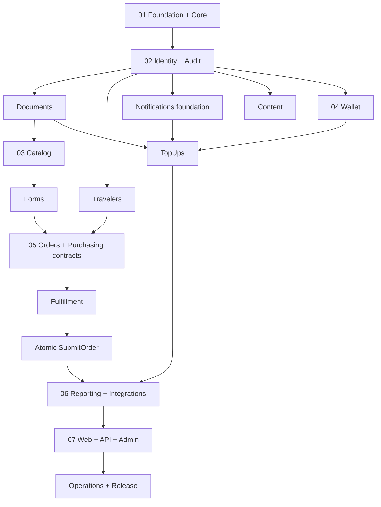

# Rehla Platform Implementation Plan

> **For agentic workers:** REQUIRED SUB-SKILL: Use superpowers:subagent-driven-development (recommended) or superpowers:executing-plans to implement this plan task-by-task. Steps use checkbox (`- [ ]`) syntax for tracking.

**Goal:** بناء الإصدار الأول الكامل من رحلة كتطبيق Laravel Modular Monolith، بحزم Composer محلية، وواجهات Web وREST API وAdmin، مع إثبات قواعد المال والخصوصية والتزامن على PostgreSQL.

**Architecture:** تطبيق Laravel واحد وقاعدة PostgreSQL واحدة، وحدود المجال في `packages/Rehla/<Package>`. تتواصل الحزم عبر Actions وQueries وContracts وDTOs معلنة، وتبقى `Web` و`Api` و`Admin` حزم عرض بلا كتابة مباشرة إلى جداول الأعمال.

**Tech Stack:** Laravel 13.x، PHP 8.5، PostgreSQL 18، Blade، Livewire، Filament 5، Sanctum، Pest/PHPUnit، Vite، Tailwind CSS، Laravel Queue وPostgreSQL Outbox.

**Spec:** `docs/REHLA-LARAVEL-PACKAGE-ARCHITECTURE.md`

**Coverage:** `docs/superpowers/plans/2026-09-11-rehla-plan-coverage.csv`

## Global Constraints

- مرجع المنتج الملزم هو `docs/REHLA-PROJECT-CONCEPT-AND-USER-JOURNEY.md` بأقسامه R01–R65.
- خريطة الاعتماد المقروءة آليًا هي `docs/architecture/rehla-package-map.json`.
- مسار الحزم حساس لحالة الأحرف: `packages/Rehla/<Package>`.
- `Core` لا يعتمد على أي حزمة Rehla، وحزم الأعمال لا تعتمد على `Web` أو`Api` أو`Admin`.
- كل جدول له حزمة مالكة واحدة، ولا تعبر Eloquent Models القابلة للتعديل حدود الحزم.
- قاعدة الاختبار PostgreSQL واسمها ينتهي بـ`_testing`؛ SQLite ممنوع في اختبارات التكامل والمال والتزامن.
- تخزن التواريخ UTC، وتعرض تقارير الإصدار الأول بمنطقة `Africa/Khartoum`.
- تمثل مبالغ SDG بعدد صحيح `amount_minor` وبمقياس 100؛ يمنع `float` في المال.
- Session للويب والإدارة، وSanctum token للـREST API، وMFA إلزامي للموظف صاحب القدرة المالية أو الإدارية الحساسة.
- المستندات الخاصة تقبل PDF وJPEG وPNG فقط؛ حد الصور 10 MiB وحد PDF هو20 MiB؛ الملفات المؤقتة تنظف بعد24ساعة، والمرفوضة تحفظ30يومًا لأغراض التدقيق.
- الإشعارات داخل التطبيق مطلوبة في الإصدار الأول؛ زر WhatsApp رابط استفسار فقط ولا ينشئ Order أوDebit أوExecution.
- السلال والمخزون والشحن المادي وتعدد العملات والجنسيات والمسافرين في الطلب الواحد والمسودات والاسترداد خارج الإصدار الأول.
- لا أثر خارجي داخل معاملة قاعدة البيانات؛ يكتب الحدث إلى Outbox داخل المعاملة ثم يسلّمه عامل مستقل.
- Ledger وAudit وOrder snapshots وFormVersion المنشور سجلات غير قابلة للتعديل أو الحذف، وتثبت الحماية باختبار SQL مباشر.
- كل مهمة تبدأ باختبار فاشل محدد، ثم أقل تنفيذ ينجحه، ثم تحقق حزمة، ثم تحقق أوسع، ثم commit مستقل.

---

## 1. ملفات الخطة وحدودها

هذه خطة برنامج رئيسية. ينفذ كل ملف فرعي كوحدة مستقلة لها بوابة مراجعة قبل الانتقال إلى الملف التالي:

| الترتيب | الخطة | الناتج القابل للتشغيل |
|---:|---|---|
| 1 | [Foundation and Core](2026-09-11-rehla-01-foundation-core.md) | مضيف Laravel، 19 حزمة، Core، حراس المعمارية، PostgreSQL CI |
| 2 | [Identity and Platform Services](2026-09-11-rehla-02-identity-platform-services.md) | الهوية والصلاحيات والتدقيق والوثائق والمسافرون وOutbox |
| 3 | [Catalog, Forms and Content](2026-09-11-rehla-03-catalog-forms-content.md) | كتالوج الخدمات وإصدارات النماذج والمحتوى |
| 4 | [Wallet and Top-ups](2026-09-11-rehla-04-wallet-topups.md) | Ledger ومحفظة وشحن بنكي ذري قابل للمراجعة |
| 5 | [Orders, Purchasing and Fulfillment](2026-09-11-rehla-05-orders-purchasing-fulfillment.md) | شراء ذري وOrder ثابت وExecution مستقل |
| 6 | [Reporting and Integrations](2026-09-11-rehla-06-reporting-integrations.md) | 12مؤشرًا، عامل Outbox، الإشعارات والتكاملات |
| 7 | [Interfaces, Operations and Release](2026-09-11-rehla-07-interfaces-operations-release.md) | Web وREST API وAdmin والتشغيل وبوابة قبول R01–R65 |

لا يبدأ ملف إلا بعد نجاح بوابة الملف السابق. يمكن تنفيذ `Documents` و`Travelers` و`Notifications` بالتوازي بعد Identity/Audit داخل الخطة الثانية، ويمكن تنفيذ `Catalog` و`Content` بالتوازي داخل الخطة الثالثة. لا يدمج التنفيذ المتوازي قبل مراجعة كل فرع مهمة على حدة.

## 2. شبكة الاعتماد والتنفيذ



## 3. قرار الإصدار الأول الذي تنفذه الخطط

توثق الخطة الأولى القرارات التالية كـADRs قبل أي migration أعمال:

| القرار | القيمة التنفيذية |
|---|---|
| العملة | `SDG` فقط، مقياس100، تخزين integer minor units |
| المصادقة | Web/Admin sessions؛ API عبر Sanctum personal access tokens |
| MFA | TOTP للموظفين ذوي قدرات approve top-up أوmanage roles أوview audit |
| الجواز | uppercase ثم إزالة المسافات والشرطات؛ uniqueness عالمي على القيمة المطَبّعة |
| الملفات | PDF/JPEG/PNG؛ فحص magic bytes وdecoder وmalware؛ خاص افتراضيًا |
| الاحتفاظ | upload مؤقت24ساعة؛ rejected30يومًا؛ attached حسب سجل الطلب |
| القنوات | in-app notifications؛ WhatsApp inquiry deep-link فقط |
| التوقيت | UTC persistence؛ تقارير وعرض `Africa/Khartoum` |
| الاستعادة | RPO =15دقيقة؛ RTO =4ساعات؛ DB وprivate blobs يعادان إلى نقطة متناسقة |
| الإلغاء | يغير Execution وفق Policy ولا يعكس المال تلقائيًا؛ refunds خارج الإصدار الأول |

إذا غير المالك قرارًا قبل التنفيذ، يحدث ADR والمواصفة وهذه الخطة معًا قبل إنشاء schema يعتمد عليه.

## 4. سجل القبول الذري

تنشئ المهمة الأولى `docs/requirements/rehla-phase-1-acceptance.csv` بالأعمدة التالية:

```csv
acceptance_id,source_requirement,package,interface,db_invariant,test_file,test_name,status,evidence,deferred_reason
```

يحتوي السجل على صف لكل متطلب ذري. الحد الأدنى الإلزامي:

- R08.01–R08.11 لأنواع حقول النموذج، وصفوف مستقلة لـlabel/order/required/helper/options/validation.
- صف لكل حقل في Traveler وBankAccount وTopUpRequest وOrder وExecution.
- R40.01–R40.14 لكل قسم Admin مع القدرة والحقول والأوامر.
- صف مستقل لكل قدرة في R47.
- R50.01–R50.05 لأخطاء المستخدم ذات الرموز الثابتة.
- R52.01–R52.13 لمراحل رحلة العميل.
- R62.01–R62.12 للمؤشرات وتعريف البسط والمقام والزمن والمصدر.
- R63.W01–R63.W13 لرحلة العميل وR63.A01–R63.A09 لرحلة الإدارة.

القيم المسموحة في `status` هي `planned`, `red`, `green`, `verified`, `deferred`. لا تصبح `verified` قبل وضع مسار الاختبار واسمه ودليل تشغيل حديث.

يوضح `2026-09-11-rehla-plan-coverage.csv` أن كل قسم R01–R65 له مهمة تنفيذ وبوابة تحقق. هذه تغطية تخطيطية على مستوى الأقسام؛ سجل القبول الذري أعلاه هو دليل التنفيذ على مستوى كل حقل وحالة.

## 5. بروتوكول تنفيذ كل مهمة

1. اقرأ المواصفة والخطة الفرعية وREADME للحزم المتأثرة.
2. أكد نظافة نطاق العمل عبر `git status --short` إن أصبح المسار مستودع Git صالحًا؛ لا تمس تغييرات غير مرتبطة.
3. حدث صفوف القبول إلى `red` وأضف اختبارًا يفشل للسبب المتوقع.
4. نفذ أقل تغيير إنتاجي يحقق العقد، ولا تنشئ طبقات أو حزم مؤجلة.
5. شغل اختبار المهمة ثم اختبارات الحزم التابعة ثم مجموعة المشروع الكاملة المطلوبة في بوابة الخطة.
6. شغل formatter، ثم أعد الاختبارات التي يمكن أن تتأثر بالتنسيق.
7. حدث دليل القبول إلى `green` داخل المهمة و`verified` فقط عند بوابة الخطة.
8. راجع diff بحثًا عن أسرار وكتابة مباشرة عبر الحزم وModels متسربة وعمليات IO داخل transactions.
9. أنشئ commit واحدًا باسم الرسالة المحدد في المهمة؛ إن لم يكن Git مهيأً، سجل الرسالة المقترحة في سجل التنفيذ بدل الادعاء بإنشاء commit.

## 6. أوامر التحقق المشتركة

تثبت الخطة الأولى scripts التالية في `composer.json`، وتستخدمها كل الخطط اللاحقة:

```json
{
  "scripts": {
    "test:unit": "php artisan test --testsuite=Unit",
    "test:packages": "php artisan test packages/Rehla",
    "test:architecture": "php artisan test tests/Architecture",
    "test:integration": "php artisan test --testsuite=Integration",
    "test:e2e": "php artisan test tests/EndToEnd",
    "analyse": "phpstan analyse --memory-limit=1G",
    "format:check": "pint --test",
    "verify": [
      "@format:check",
      "@analyse",
      "@test:architecture",
      "@test:packages",
      "@test:integration",
      "@test:e2e"
    ]
  }
}
```

بوابة أي خطة فرعية:

```bash
composer verify
npm run build
git diff --check
```

النتيجة المتوقعة: exit code0 لكل أمر، ولا warning مخفي باعتباره نجاحًا.

## 7. Definition of Done الكاملة

- الحزم التسع عشرة موجودة وتطابق manifests خريطة `rehla-package-map.json` بلا cycle أو import محظور.
- تثبت PostgreSQL transactions أنه لا يوجد debit بلا Order وExecution، ولا Order أوExecution بلا debit.
- يثبت اعتماد TopUp المتكرر والمتزامن قيد Credit واحدًا فقط.
- يثبت شراءان متزامنان على رصيد واحد نجاح عملية واحدة دون رصيد سلبي.
- لا تعدل FormVersion منشورة أو Order snapshots أوLedger أوAudit حتى عبر SQL مباشر.
- لا يقدم مستند خاص URL عامًا دائمًا؛ حسابان وموظف محدود لا يصلون إلى مستندات غير مصرح بها.
- Web وAPI وAdmin تستعمل Actions وQueries نفسها، ولا تكرر منطق المال أو transitions.
- يطابق OpenAPI جميع مسارات `/api/v1` ويثبت 401 و403 و404 و409 و422 وعقود الأخطاء.
- تمر رحلة عميل R63 ورحلة إدارة R63 من المتصفح بالإنجليزية والعربية/RTL وباستخدام لوحة المفاتيح.
- تنتج المؤشرات الاثنا عشر قيمًا معروفة من fixture ثابت وبمنطقة الزمن المقررة.
- ينجح fresh install وupgrade migration وworker restart وoutbox lease recovery وتمرين restore لـPostgreSQL وprivate blobs.
- يحتوي سجل القبول على دليل لكل صف، وتبقى المتطلبات خارج النطاق فقط بحالة `deferred` وسبب ومصدر قرار.

## 8. التوقف الآمن والاسترجاع

- قبل أول بيانات حقيقية يمكن عكس migrations الخاصة بالمهمة الحالية فقط.
- بعد وجود Ledger أوAudit أوOrder أوFormVersion منشور، يكون التصحيح forward-only: migration جديدة أوقيد تصحيحي أوإصدار نموذج جديد.
- توقف feature flags مسارات submit/approve/transition عند الطوارئ دون حذف تاريخ.
- لا تستخدم `migrate:fresh` خارج بيئة محلية أوCI محمية، ولا تستخدم rollback مدمرًا في staging أوproduction.
- لا ينتقل الإصدار إلى الإنتاج إن فشل شرط واحد من Definition of Done.
